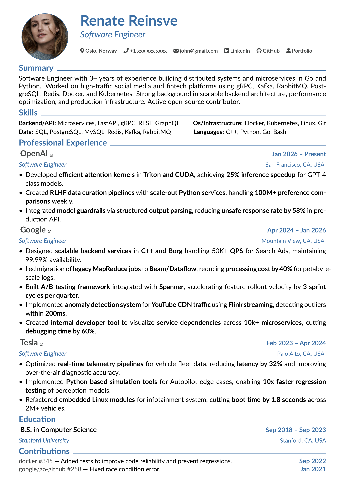
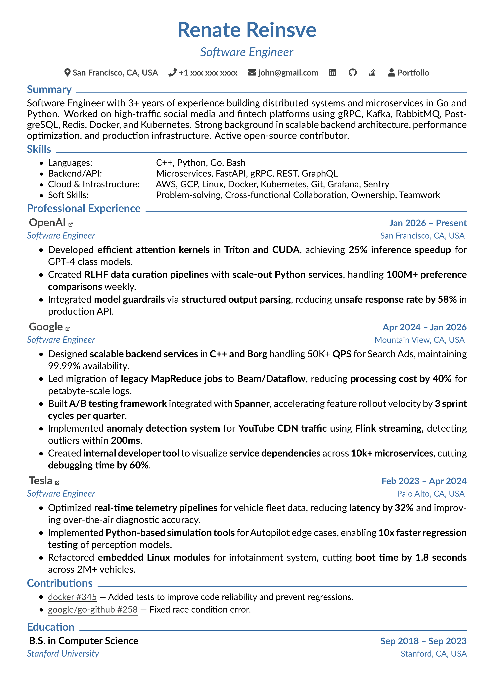

# melo CV
After playing with tons of fancy CV generator shits, I decided to write a simple, readable and beautiful template with full control from scratch using `TeX`.

<div style="width: 100%; text-align: center;">
  <div style="display: inline-flex; gap: 10px; align-items: center;">
    
    
  </div>
</div>

[PDF](./cv.pdf) version.

## Installation

Install [**TeX Live**](https://tug.org/texlive). 

### Linux 

```bash
sudo apt install texlive
```

### Mac
```
brew install texlive
```

### Windows

Install [**MiKTeX** ](https://miktex.org)

> [!NOTE]
> The **LuaLaTeX** engine included in most distributions.

## Run
I'm using `lualatex` and [`vimtex`](https://github.com/lervag/vimtex) neovim plugin.
```bash
lualatex cv.tex
# or
pdflatex cv.tex                    
# or
xelatex cv.tex                     
# or
latexmk -pdf -lualatex cv.tex      
```

If you want to convert pdf to image, use this command:

```bash
pdftoppm -png -r 300 cv.pdf output
```

## Contributation
Feel free to add features or fix bugs. Just open an **issue** or **PR**.

Enjoy! 🥂

